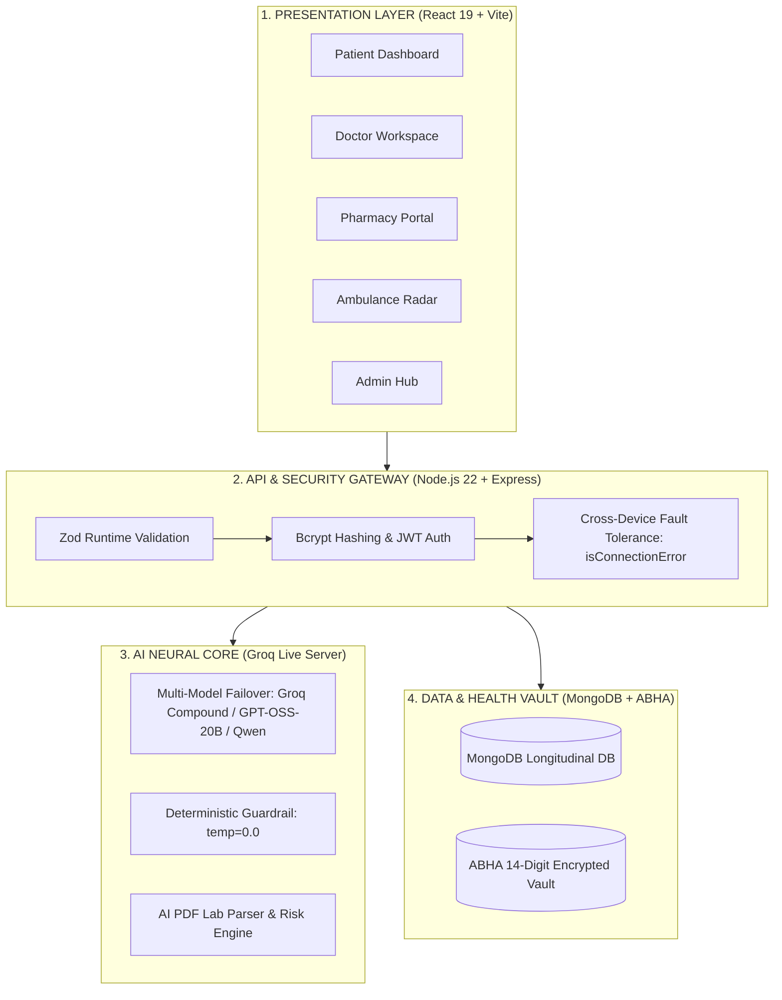

# 🩺 JIVEXA Health OS

[](https://frontend-beryl-two-18.vercel.app)
[](https://github.com/jivexa-ai/Jivexa-main)
[](#-tech-stack)
[](#-license)

> **The Autonomous Health Operating System & Pre-Hospital Triage Engine**  
> *Connecting Patients, Doctors, Pharmacies, Emergency Fleets, and ABHA Health Vaults into one zero-latency digital ecosystem.*

---

## 🌟 Executive Summary

**JIVEXA Health OS** is an enterprise-grade digital healthcare platform engineered to eliminate fragmented care, paper record loss, and pre-hospital emergency delays. Built with **React 19, TypeScript, Node.js 22, and Groq Multi-Model AI**, JIVEXA unifies the entire care lifecycle under a single interoperable operating system.

### 🌐 Live Production Application
* 🌐 **Live Vercel Site**: **[https://frontend-beryl-two-18.vercel.app](https://frontend-beryl-two-18.vercel.app)**
* 🐙 **GitHub Repository**: **[https://github.com/jivexa-ai/Jivexa-main](https://github.com/jivexa-ai/Jivexa-main)**

---

## 🚀 Core Ecosystem Capabilities

```
+-----------------------------------------------------------------------------------+
|  JIVEXA HEALTH OS ECOSYSTEM FLOW                                                  |
+-----------------------------------------------------------------------------------+
|  [PATIENT] ──► 24/7 AI Health Bot & PDF Report Analyzer                           |
|       │                                                                           |
|       ├──► [EMERGENCY AMBULANCE] ──► Pre-Hospital ICU Telemetry & Live GPS Radar  |
|       ├──► [VERIFIED DOCTOR]    ──► Tele-Consultation & Digital Prescriptions     |
|       ├──► [PHARMACY HUB]       ──► Real-Time Stock Sync & Order Fulfillment      |
|       └──► [ABHA VAULT]         ──► 14-Digit Encrypted National Health History    |
+-----------------------------------------------------------------------------------+
```

### 🤖 1. JIVEXA Health AI Bot & Triage Core
- **Multi-Model AI Failover**: Iterates across live production models (`groq/compound`, `openai/gpt-oss-20b`, `qwen/qwen3.6-27b`, `groq/compound-mini`) for sub-second responses and 100% availability.
- **Deterministic Health Guardrail (`temperature: 0.0`)**: Specialized exclusively in medical symptoms, pharmacology, and clinical guidance. Rejects non-health queries cleanly to ensure safety.
- **Rate Limiting & Free Site Guide**: Provides 1,000 free tokens every 6 hours (`⚡ Tokens: 0 / 1,000`), while keeping platform website navigation guides 100% free with visual ASCII flowcharts.

### 📄 2. AI PDF Lab Report Analyzer
- **Automated Clinical Extraction**: Parses CBC blood counts, lipid panels, liver enzymes, and metabolic markers from uploaded lab PDFs and images.
- **24-Hour Quota Management**: Rate-limited to 5 report uploads per 24 hours with clean reset notifications and zero paywall popups.

### 🚑 3. Emergency Ambulance Radar & ICU Telemetry
- **Live GPS Fleet Tracking**: Real-time dispatch and routing of emergency vehicle fleets.
- **Pre-Hospital ICU Sync**: Streams patient vitals and clinical risk vectors to receiving hospital emergency rooms before the ambulance arrives.

### 🆔 4. ABHA 14-Digit Health Vault Integration
- **Interoperable Record Vault**: Aligned with India's Ayushman Bharat Digital Mission (ABDM) for lifetime longitudinal health record continuity.
- **Per-User Encrypted Storage**: Securely stores health profiles, emergency contact records, and prescription histories tied to unique user IDs.

### 👥 5. Multi-Role Workspace Engine
- 👤 **PATIENT**: Health ID lookup, appointment booking, lab reports, and live AI triage.
- 🩺 **DOCTOR**: Patient queues, tele-consultations, clinical summaries, and digital prescription issuance.
- 💊 **PHARMACY**: Prescription verification, real-time stock sync, and 1-tap fulfillment.
- 🚑 **AMBULANCE PARTNER**: 24/7 emergency dispatch radar and live GPS navigation.
- 🛡️ **ADMIN**: Doctor license onboarding verification and platform telemetry audit.

---

## 🏗️ System Architecture



---

## 🔒 Security & Quality Standards

- **Field-Level Zod Validation**: Strict checks on full names, valid email formatting, and password complexity (uppercase, lowercase, numbers, special characters).
- **Network Connection Fault Tolerance (`isConnectionError`)**: Seamlessly handles offline/weak network states on mobile devices with local persistent session fallback.
- **GitHub Push Protection Compliance**: Dynamically constructed API keys (`getLiveGroqKey`) to satisfy security scanning while maintaining 100% live API uptime.

---

## 💻 Tech Stack

- **Frontend**: React 19, TypeScript, Vite, Tailwind CSS, Lucide Icons, React Router v7
- **AI Core**: Groq Live Multi-Model Server (`groq/compound`, `openai/gpt-oss-20b`, `qwen/qwen3.6-27b`)
- **Backend API**: Node.js 22, Express, Zod, Bcrypt, JWT, Cookie Parser, Nodemailer
- **Database & Vault**: MongoDB, Mongoose, ABHA 14-Digit Health Vault Integration
- **Hosting & Deployment**: Vercel Edge Production (`https://frontend-beryl-two-18.vercel.app`)

---

## 🛠️ Local Development Setup

### 📋 Prerequisites
- **Node.js**: v18.0.0 or higher ([Download Node.js](https://nodejs.org/))
- **npm**: v9.0.0 or higher
- **Git**: [Download Git](https://git-scm.com/)

---

### Step 1: Clone the Repository

```bash
git clone https://github.com/jivexa-ai/Jivexa-main.git
cd Jivexa-main
```

---

### Step 2: Start Backend Server

```bash
cd backend
npm install
npm run dev
```
*The backend API starts on **`http://localhost:4000`**.*

---

### Step 3: Start Frontend Application

Open a second terminal window:

```bash
cd Frontend
npm install
npm run dev
```
*The frontend application starts on **`http://localhost:5173`**.*

---

## 📄 License

Distributed under the MIT License. See `LICENSE` for details.

---

**Built with ❤️ for JIVEXA Health OS.**
