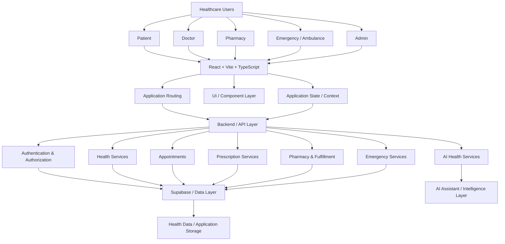
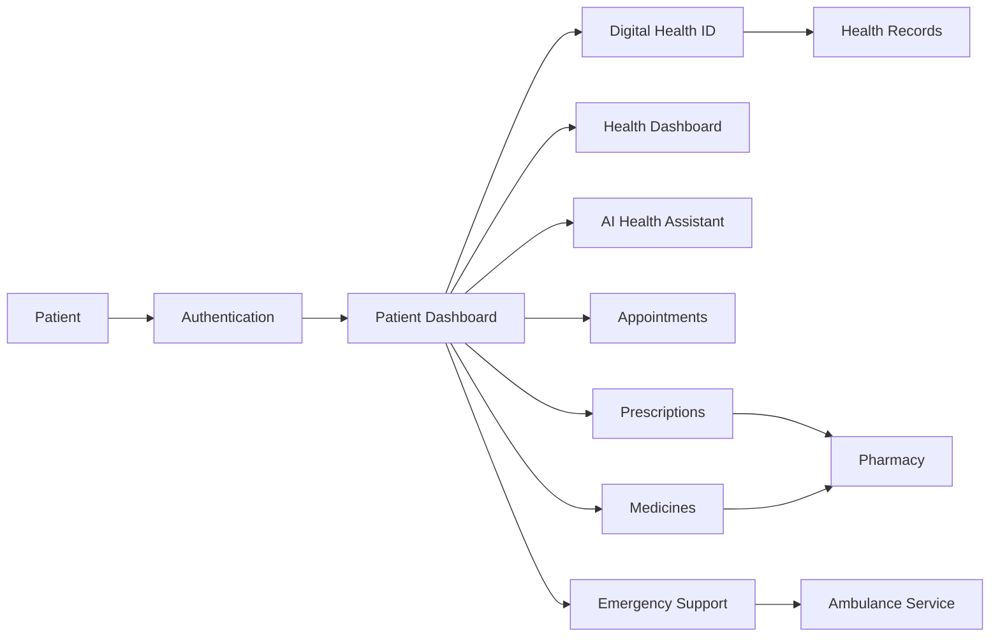
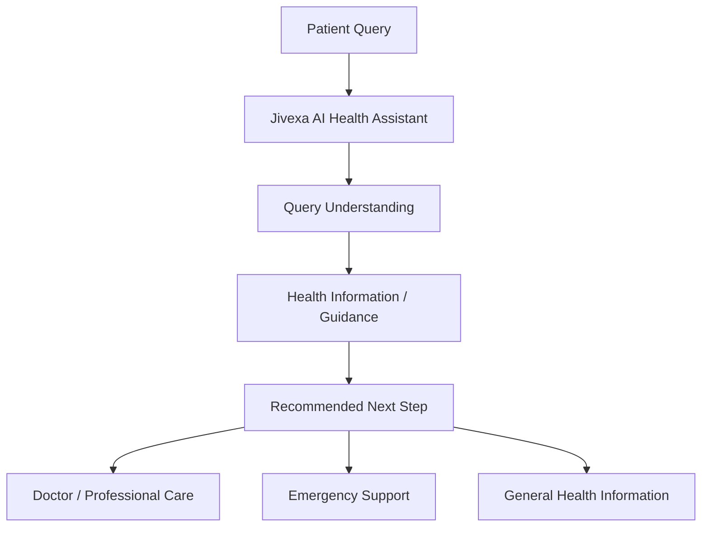
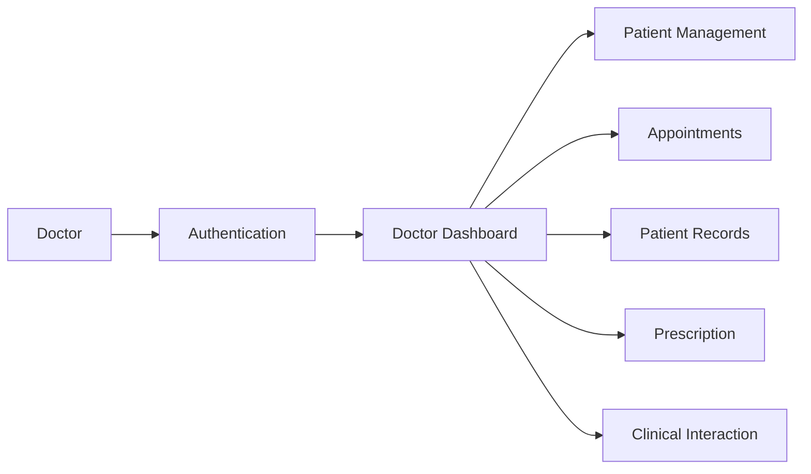
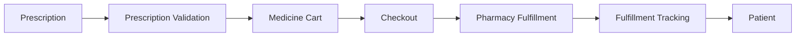
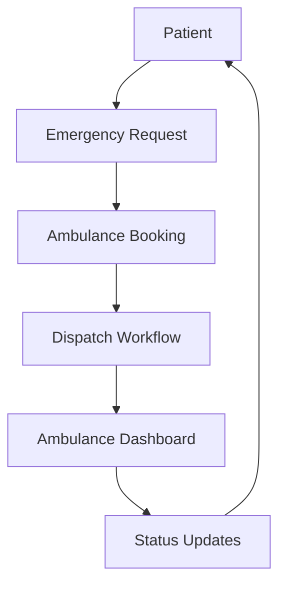
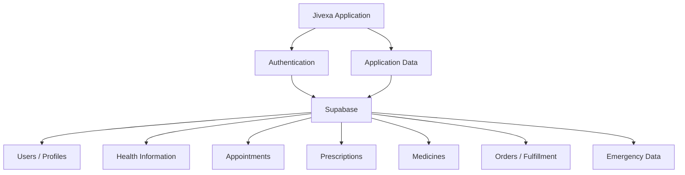
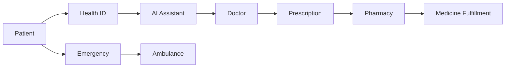

Bilkul Mayank. **Koi architecture change nahi kar raha hoon.** Existing LIVE link **sabse upar bhi** aur **sabse neeche bhi** rahega. Baaki README as-is professional format mein hai.

# 🩺 Jivexa Health OS

### AI-Powered Health. Connected Care.

[](https://frontend-beryl-two-18.vercel.app)

**Live Production App:**
[https://frontend-beryl-two-18.vercel.app](https://frontend-beryl-two-18.vercel.app)

---

## 📌 Overview

> **Jivexa Health OS** is a unified digital healthcare ecosystem designed to connect patients, doctors, pharmacies, and emergency services through a patient-centric digital platform.

Jivexa Health OS aims to simplify fragmented healthcare interactions by bringing essential healthcare workflows into a single digital ecosystem.

The platform is designed around a connected healthcare flow:

```text
Patient
   ↓
Digital Health ID
   ↓
AI Health Assistant
   ↓
Doctor / Clinical Support
   ↓
Prescription
   ↓
Pharmacy
   ↓
Medicine Fulfillment
   ↓
Emergency Support
```

Jivexa focuses on making healthcare access more **connected, accessible, organized, and patient-centric**.

---

# 🏗️ System Architecture



---

# 🧩 Architecture Layers

## 1. Presentation Layer

The frontend provides the user-facing healthcare experience.

### Technology

* React
* Vite
* TypeScript
* Vanilla CSS
* Lucide React
* React Router

### Major Interfaces

```text
Patient Portal
Doctor Portal
Pharmacy Portal
Ambulance Portal
Admin Portal
```

---

# 👤 Patient Architecture



### Patient Features

* Patient profile
* Digital Health ID
* Health dashboard
* Health records
* AI health assistant
* Appointment management
* Prescription management
* Medicine management
* Pharmacy fulfillment
* Emergency support
* Ambulance workflow

---

# 🪪 Digital Health ID

The Digital Health ID is designed as a central identity layer for the patient's healthcare interactions.

```text
Patient
   │
   ▼
Digital Health ID
   │
   ├── Patient Profile
   ├── Health Information
   ├── Medical Records
   ├── Prescriptions
   └── Healthcare Interactions
```

The system can provide a dedicated Health ID interface with a QR-based identity experience.

---

# 🤖 AI Health Assistant

Jivexa includes an AI-assisted healthcare interaction layer.



### AI Layer Responsibilities

* Health information assistance
* Symptom-oriented guidance
* Care navigation
* Patient support
* Healthcare workflow assistance

> **Important:** Jivexa AI is intended as an assistive technology layer and should not replace qualified medical professionals or emergency medical services.

---

# 👨‍⚕️ Doctor Architecture



### Doctor Features

* Doctor dashboard
* Patient management
* Appointment workflow
* Patient information
* Prescription creation
* Clinical interaction workflow

---

# 💊 Pharmacy Architecture



### Pharmacy Features

* Prescription validation
* Medicine catalog
* Cart
* Checkout
* Pharmacy fulfillment
* Order tracking
* Patient medicine workflow

---

# 🚑 Emergency / Ambulance Architecture



### Emergency Module

* Emergency support interface
* Ambulance request
* Dispatch workflow
* Ambulance dashboard
* Emergency status tracking

---

# 🔐 Authentication & Authorization

Jivexa follows a role-based application architecture.

```text
                    Authentication
                          │
                          ▼
                  Role Identification
                          │
        ┌─────────────────┼─────────────────┐
        │        │        │        │         │
        ▼        ▼        ▼        ▼         ▼
     Patient   Doctor  Pharmacy  Ambulance  Admin
        │        │        │        │         │
        ▼        ▼        ▼        ▼         ▼
   Dashboard Dashboard Dashboard Dashboard Dashboard
```

Role-based access helps ensure that different users access the workflows relevant to their role.

---

# 🗄️ Data Architecture



### Data Layer

Jivexa can operate with a Supabase-backed data layer when the required environment configuration is available.

A local/mock mode can also be used for development and frontend testing.

---

# 🔄 End-to-End Healthcare Flow



---

# 🧱 Frontend Architecture

```text
src/
│
├── components/
│   ├── ui/
│   ├── dashboards/
│   ├── patient/
│   ├── doctor/
│   ├── pharmacy/
│   └── ambulance/
│
├── pages/
│   ├── patient/
│   ├── doctor/
│   ├── pharmacy/
│   ├── ambulance/
│   └── admin/
│
├── contexts/
│
├── services/
│
├── lib/
│
├── hooks/
│
├── assets/
│
├── App.tsx
└── main.tsx
```

> The exact folder structure may evolve as the product architecture expands.

---

# ⚙️ Technology Stack

| Layer           | Technology                       |
| --------------- | -------------------------------- |
| Frontend        | React                            |
| Build Tool      | Vite                             |
| Language        | TypeScript                       |
| Styling         | Vanilla CSS                      |
| Icons           | Lucide React                     |
| Routing         | React Router                     |
| Backend/Data    | Supabase / API Layer             |
| Authentication  | Supabase Auth / Application Auth |
| AI              | AI Service Layer                 |
| Deployment      | Vercel                           |
| Version Control | Git + GitHub                     |

---

# 🚀 Local Development

## Prerequisites

Make sure you have:

* Node.js
* npm
* Git

## Installation

```bash
git clone https://github.com/jivexa-ai/Jivexa-main.git

cd Jivexa-main

npm install
```

## Start Development Server

```bash
npm run dev
```

Navigate to:

```text
http://localhost:5173
```

---

# 🔑 Environment Configuration

Create a `.env` file for local development when using Supabase-backed functionality.

Example:

```env
VITE_SUPABASE_URL=your_supabase_project_url
VITE_SUPABASE_ANON_KEY=your_supabase_anon_key
```

> Never commit private API keys, service-role keys, passwords, or other secrets to GitHub.

---

# 🌐 Live Production Deployment

Jivexa's production frontend is deployed on Vercel.

[](https://frontend-beryl-two-18.vercel.app)

**Production URL:**
[https://frontend-beryl-two-18.vercel.app](https://frontend-beryl-two-18.vercel.app)

---

# 🔒 Security & Privacy

Jivexa is designed with healthcare data sensitivity in mind.

Key principles include:

* Role-based access
* Authentication
* Controlled data access
* Environment-based secrets
* Separation of frontend and backend responsibilities
* Secure API communication
* Avoiding sensitive credentials in source code

### Healthcare Disclaimer

Jivexa is a technology platform and does not itself constitute a medical diagnosis or treatment service.

AI-generated information should not be considered a substitute for qualified medical advice, diagnosis, or emergency care.

---

# 📈 Product Architecture Roadmap

## Phase 1 — MVP

* Patient platform
* Digital Health ID
* AI Health Assistant
* Doctor workflow
* Appointment system
* Prescription workflow
* Pharmacy workflow
* Emergency interface

## Phase 2 — Connected Healthcare

* Healthcare provider integrations
* Real-time emergency coordination
* Expanded pharmacy network
* Advanced patient records
* Improved AI assistance
* Notification infrastructure

## Phase 3 — Health Intelligence

* Advanced healthcare analytics
* Interoperability
* Intelligent care navigation
* Population-level insights
* Scalable healthcare infrastructure

---

# 🎯 Vision

> **Build a connected healthcare infrastructure where patients can access, manage, and navigate essential healthcare services through one intelligent platform.**

Jivexa aims to reduce fragmentation between patients and healthcare service providers by creating a connected digital healthcare ecosystem.

---

# 👨‍💻 Founder

**Mayank Gangwar**
Founder & CEO — Jivexa

### Jivexa Health OS

**AI-Powered Health. Connected Care.**

---

# 📜 Disclaimer

Jivexa is currently a technology/MVP platform intended for experimentation, product validation, and healthcare workflow development.

It should not be used as a substitute for professional medical diagnosis, treatment, or emergency medical services.

---

# 🌐 Jivexa — Live Production App

[](https://frontend-beryl-two-18.vercel.app)

**Open Jivexa:**
[https://frontend-beryl-two-18.vercel.app](https://frontend-beryl-two-18.vercel.app)

---

## ⭐ Jivexa Health OS

**AI-Powered Health. Connected Care.**

Built with the vision of making healthcare more connected, accessible, organized, and patient-centric.


**Built with ❤️ for JIVEXA Health OS.**
