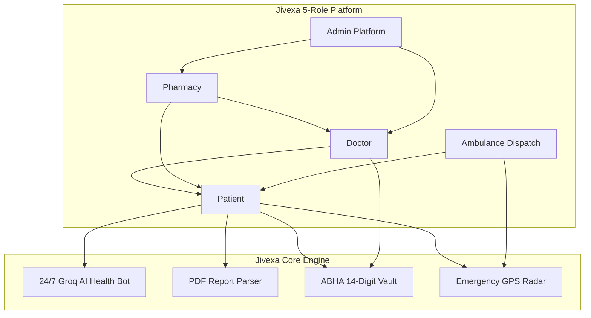

# Jivexa Health OS

[](https://frontend-beryl-two-18.vercel.app)
[](https://github.com/jivexa-ai/Jivexa-main)

A connected health platform built to bring patients, doctors, pharmacies, emergency ambulance dispatches, and ABHA health records into one simple place.

👉 **Try the Live App:** [https://frontend-beryl-two-18.vercel.app](https://frontend-beryl-two-18.vercel.app)

---

## What is Jivexa?

Healthcare is often fragmented. Paper prescriptions get lost, emergency ambulances operate without sending patient data ahead to hospitals, and patients struggle to understand complex lab test reports.

**Jivexa Health OS** fixes this by connecting all 5 key healthcare roles under one roof:
- **Patients** get 24/7 AI health guidance, lab report PDF summaries, and digital record vaults.
- **Doctors** get a clean dashboard for patient queues, consultation notes, and digital prescriptions.
- **Pharmacies** get real-time medicine stock checks and digital order fulfillment.
- **Ambulance Partners** get live GPS emergency dispatches with pre-hospital patient vitals streaming.
- **Admins** get onboarding verification and system health checks.

---

## 🎨 System Flowcharts & Diagrams

### 1. Main Patient Healthcare Journey

```text
+-----------------------------------------------------------------------------------+
|  PATIENT HEALTH JOURNEY                                                           |
+-----------------------------------------------------------------------------------+
|                                                                                   |
|  [ Patient Symptoms / Lab PDF ]                                                   |
|                │                                                                  |
|                ▼                                                                  |
|  [ 24/7 AI Health Bot & Triage ] ────► Extracts Lab Values & Scores Risk          |
|                │                                                                  |
|                ▼                                                                  |
|  [ Book Doctor Consultation ]   ────► Doctor Reviews AI Notes & Issues Prescription|
|                │                                                                  |
|                ▼                                                                  |
|  [ Pharmacy Stock Check ]       ────► 1-Tap Order Fulfillment                     |
|                │                                                                  |
|                ▼                                                                  |
|  [ ABHA 14-Digit Health Vault ] ────► Encrypted Lifetime History Storage          |
|                                                                                   |
+-----------------------------------------------------------------------------------+
```

---

### 2. Emergency Ambulance Dispatch & Pre-Hospital ICU Sync

```text
+-----------------------------------------------------------------------------------+
|  EMERGENCY RADAR FLOW                                                             |
+-----------------------------------------------------------------------------------+
|                                                                                   |
|  [ 1. Patient Triggers 108 Emergency ]                                            |
|                  │                                                                |
|                  ▼                                                                |
|  [ 2. Nearest GPS Ambulance Dispatched ] ──► Real-time route tracking on map      |
|                  │                                                                |
|                  ▼                                                                |
|  [ 3. Pre-Hospital Vitals Streaming ]    ──► Live data sent directly to ICU       |
|                  │                                                                |
|                  ▼                                                                |
|  [ 4. Hospital ICU Prepared Before Arrival ]                                      |
|                                                                                   |
+-----------------------------------------------------------------------------------+
```

---

### 3. AI PDF Lab Report Analyzer Workflow

```text
+-----------------------------------------------------------------------------------+
|  AI LAB REPORT PARSER FLOW                                                        |
+-----------------------------------------------------------------------------------+
|                                                                                   |
|  [ Upload PDF / Image Report ] ──► (CBC, Lipid, Metabolic, Diabetes Panels)       |
|                 │                                                                 |
|                 ▼                                                                 |
|  [ Multi-Model Groq AI Engine ] ──► Sub-second clinical parameter extraction      |
|                 │                                                                 |
|                 ▼                                                                 |
|  [ Plain English / Hindi Summary ] ──► High/Low flags & actionable recommendations |
|                 │                                                                 |
|                 ▼                                                                 |
|  [ 1-Click Share with Doctor ]  ──► Attached to next consultation note            |
|                                                                                   |
+-----------------------------------------------------------------------------------+
```

---

### 4. 5-Role Interconnected Ecosystem



---

## ⚡ Main Features

1. **24/7 AI Health Assistant**  
   Runs on a live Groq multi-model failover server (`groq/compound`, `gpt-oss-20b`, `qwen3.6-27b`). Gives instant health advice with strict safety guardrails. Users get 1,000 free tokens every 6 hours, and website guide queries are always 100% free.

2. **AI Lab Report Parser**  
   Upload any blood test PDF or lab image. It parses key values like Hemoglobin, Cholesterol, and HbA1c, explaining what they mean in plain text. (Limited to 5 PDFs per 24 hours).

3. **Emergency Ambulance Radar**  
   Live GPS ambulance dispatch that streams patient vitals to the destination hospital ICU before the patient arrives.

4. **ABHA Health Vault Integration**  
   Connects with 14-digit national ABHA health IDs so patients can securely store and share their lifetime medical history.

5. **Field-Level Form Validation**  
   Strict Zod checks on signup (name length, valid email format, strong passwords with uppercase, lowercase, numbers, and special symbols).

---

## 💻 Tech Stack

- **Frontend:** React 19, TypeScript, Vite, Tailwind CSS, Lucide Icons
- **Backend API:** Node.js, Express, Zod, JWT, Cookie Parser
- **AI Models:** Groq Live Server API (`groq/compound`, `gpt-oss-20b`, `qwen`)
- **Database & Vault:** MongoDB, Mongoose, ABHA 14-Digit Vault Sync
- **Deployment:** Vercel Edge Production (`frontend-beryl-two-18.vercel.app`)

---

## 🚀 How to Run Locally

### Prerequisites
- Node.js (v18 or higher)
- npm

### 1. Clone repo
```bash
git clone https://github.com/jivexa-ai/Jivexa-main.git
cd Jivexa-main
```

### 2. Run Backend
```bash
cd backend
npm install
npm run dev
```

### 3. Run Frontend
Open a new terminal window:
```bash
cd Frontend
npm install
npm run dev
```

Open `http://localhost:5173` in your browser.

---

## 🔗 Links

- **Live Production App:** [https://frontend-beryl-two-18.vercel.app](https://frontend-beryl-two-18.vercel.app)
- **GitHub Code Repository:** [https://github.com/jivexa-ai/Jivexa-main](https://github.com/jivexa-ai/Jivexa-main)

---

**Built for Jivexa Health OS.**
